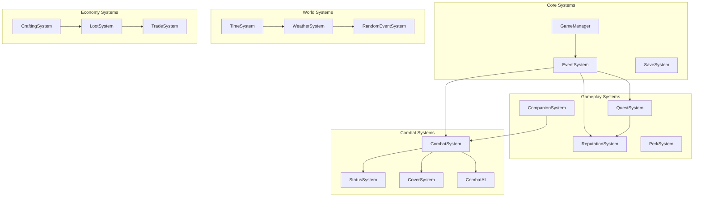

# Design Document: Sistemas AAA para RPG Isométrico

> ⚠️ **IMPORTANTE - ANALISAR ANTES DE IMPLEMENTAR**
> 
> Este documento contém designs para múltiplos sistemas complexos.
> Antes de implementar qualquer sistema:
> 1. Revisar se o sistema é realmente necessário para o MVP
> 2. Avaliar dependências entre sistemas
> 3. Priorizar baseado no impacto no gameplay
> 4. Considerar se pode ser simplificado
> 5. Discutir com o usuário qual sistema implementar primeiro

## Overview

Este documento descreve a arquitetura e design dos sistemas AAA para o RPG isométrico. Os sistemas são projetados para serem:
- **Modulares**: Cada sistema funciona independentemente
- **Extensíveis**: Fácil adicionar novos conteúdos
- **Substituíveis**: Assets podem ser trocados facilmente
- **Performáticos**: Otimizados para Godot 4.x

## Architecture Overview



---

## PARTE 1: SISTEMAS DE GAMEPLAY CORE

### 1.1 Quest System

```gdscript
# Estrutura de dados
class_name QuestData
extends Resource

@export var id: String
@export var title: String
@export var description: String
@export var objectives: Array[QuestObjective]
@export var rewards: Array[QuestReward]
@export var prerequisites: Array[String]  # IDs de quests necessárias
@export var faction_requirements: Dictionary  # {faction_id: min_reputation}

class_name QuestObjective
extends Resource

@export var id: String
@export var description: String
@export var type: ObjectiveType  # KILL, COLLECT, TALK, REACH, CUSTOM
@export var target: String
@export var required_amount: int
@export var current_amount: int
@export var optional: bool
```

**Interface do QuestSystem:**
```gdscript
class_name QuestSystem
extends Node

signal quest_started(quest_id: String)
signal quest_updated(quest_id: String, objective_id: String)
signal quest_completed(quest_id: String)
signal quest_failed(quest_id: String)

func start_quest(quest_id: String) -> bool
func update_objective(quest_id: String, objective_id: String, amount: int)
func complete_quest(quest_id: String)
func fail_quest(quest_id: String)
func get_active_quests() -> Array[QuestData]
func get_quest_status(quest_id: String) -> QuestStatus
```

### 1.2 Companion System

```gdscript
class_name CompanionData
extends Resource

@export var id: String
@export var display_name: String
@export var scene_path: String
@export var base_stats: Dictionary
@export var personality: CompanionPersonality
@export var recruitment_quest: String
@export var likes: Array[String]  # Ações que aumentam afinidade
@export var dislikes: Array[String]  # Ações que diminuem afinidade

class_name CompanionSystem
extends Node

signal companion_recruited(companion_id: String)
signal companion_dismissed(companion_id: String)
signal companion_affinity_changed(companion_id: String, new_value: int)
signal companion_incapacitated(companion_id: String)

var active_companions: Array[CompanionInstance] = []
var max_companions: int = 2

func recruit_companion(companion_id: String) -> bool
func dismiss_companion(companion_id: String)
func get_companion(companion_id: String) -> CompanionInstance
func set_companion_behavior(companion_id: String, behavior: AIBehavior)
func change_affinity(companion_id: String, amount: int)
```

### 1.3 Reputation System

```gdscript
class_name FactionData
extends Resource

@export var id: String
@export var name: String
@export var description: String
@export var allied_factions: Array[String]
@export var enemy_factions: Array[String]
@export var reputation_thresholds: Dictionary  # {level: threshold}

class_name ReputationSystem
extends Node

signal reputation_changed(faction_id: String, old_value: int, new_value: int)
signal reputation_level_changed(faction_id: String, new_level: String)

var reputations: Dictionary = {}  # {faction_id: int}

const REPUTATION_LEVELS = {
    "VILIFIED": -100,
    "HATED": -50,
    "DISLIKED": -25,
    "NEUTRAL": 0,
    "LIKED": 25,
    "RESPECTED": 50,
    "IDOLIZED": 100
}

func modify_reputation(faction_id: String, amount: int)
func get_reputation(faction_id: String) -> int
func get_reputation_level(faction_id: String) -> String
func is_hostile(faction_id: String) -> bool
```

### 1.4 Perk System

```gdscript
class_name PerkData
extends Resource

@export var id: String
@export var name: String
@export var description: String
@export var icon: Texture2D
@export var max_ranks: int = 1
@export var prerequisites: Dictionary  # {stat: min_value, perk: required_perk}
@export var effects: Array[PerkEffect]

class_name PerkEffect
extends Resource

@export var type: EffectType  # STAT_BONUS, SKILL_BONUS, SPECIAL_ABILITY
@export var target: String
@export var value: float
@export var per_rank: bool

class_name PerkSystem
extends Node

signal perk_unlocked(perk_id: String)
signal perk_points_changed(new_value: int)

var unlocked_perks: Dictionary = {}  # {perk_id: rank}
var available_points: int = 0

func unlock_perk(perk_id: String) -> bool
func can_unlock_perk(perk_id: String) -> bool
func get_perk_effect(perk_id: String) -> Array[PerkEffect]
func add_perk_points(amount: int)
```

---

## PARTE 2: SISTEMAS DE COMBATE AVANÇADO

### 2.1 Status Effect System

```gdscript
class_name StatusEffect
extends Resource

@export var id: String
@export var name: String
@export var icon: Texture2D
@export var duration: float  # -1 para permanente
@export var tick_interval: float = 1.0
@export var stackable: bool = false
@export var max_stacks: int = 1
@export var effects: Array[StatusEffectData]

class_name StatusEffectData
extends Resource

@export var type: StatusType  # DAMAGE, HEAL, STAT_MOD, MOVEMENT_MOD
@export var value: float
@export var element: DamageElement  # FIRE, POISON, RADIATION, etc.

class_name StatusSystem
extends Node

signal status_applied(target: Node, status_id: String)
signal status_removed(target: Node, status_id: String)
signal status_ticked(target: Node, status_id: String)

func apply_status(target: Node, status_id: String, source: Node = null)
func remove_status(target: Node, status_id: String)
func has_status(target: Node, status_id: String) -> bool
func get_active_statuses(target: Node) -> Array[ActiveStatus]
func clear_all_statuses(target: Node)
```

### 2.2 Cover System

```gdscript
class_name CoverPoint
extends Node2D

@export var cover_type: CoverType  # HALF, FULL
@export var destructible: bool = false
@export var hp: int = 100
@export var cover_bonus: float = 0.25  # Redução de chance de hit

class_name CoverSystem
extends Node

func get_cover_at_position(pos: Vector2) -> CoverPoint
func calculate_cover_bonus(attacker: Node, target: Node) -> float
func is_in_cover(entity: Node) -> bool
func damage_cover(cover: CoverPoint, damage: int)
func get_best_cover_position(entity: Node, threat: Node) -> Vector2
```

### 2.3 Combat AI System

```gdscript
class_name CombatAI
extends Node

enum AIBehavior { AGGRESSIVE, DEFENSIVE, SUPPORT, FLANKER, SNIPER }
enum AIState { IDLE, ENGAGING, RETREATING, SEEKING_COVER, FLANKING }

@export var behavior: AIBehavior = AIBehavior.AGGRESSIVE
@export var aggression: float = 0.5
@export var self_preservation: float = 0.5
@export var team_awareness: float = 0.5

var current_state: AIState = AIState.IDLE
var current_target: Node = null
var threat_list: Array[ThreatEntry] = []

func evaluate_situation() -> AIState
func select_target() -> Node
func select_action() -> CombatAction
func find_tactical_position() -> Vector2
func coordinate_with_allies(allies: Array[Node])
```

---

## PARTE 3: SISTEMAS DE PROGRESSÃO E ECONOMIA

### 3.1 Crafting System

```gdscript
class_name CraftingRecipe
extends Resource

@export var id: String
@export var result_item: String
@export var result_quantity: int = 1
@export var ingredients: Array[CraftingIngredient]
@export var required_skill: String
@export var required_skill_level: int
@export var workbench_type: String  # "", "chemistry", "weapons", etc.
@export var crafting_time: float = 1.0

class_name CraftingSystem
extends Node

signal item_crafted(recipe_id: String, quality: float)
signal recipe_learned(recipe_id: String)

var known_recipes: Array[String] = []

func can_craft(recipe_id: String) -> bool
func craft_item(recipe_id: String) -> Dictionary  # Retorna item criado
func learn_recipe(recipe_id: String)
func get_available_recipes(workbench_type: String = "") -> Array[CraftingRecipe]
func calculate_quality(recipe_id: String) -> float  # Baseado em skill
```

### 3.2 Loot System

```gdscript
class_name LootTable
extends Resource

@export var id: String
@export var entries: Array[LootEntry]
@export var guaranteed_drops: Array[String]
@export var min_items: int = 1
@export var max_items: int = 5

class_name LootEntry
extends Resource

@export var item_id: String
@export var weight: float = 1.0
@export var min_quantity: int = 1
@export var max_quantity: int = 1
@export var level_requirement: int = 0
@export var rarity_modifier: bool = false

class_name LootSystem
extends Node

signal loot_generated(source: Node, items: Array)

func generate_loot(table_id: String, context: Dictionary = {}) -> Array[Dictionary]
func apply_rarity_modifier(item: Dictionary) -> Dictionary
func get_rarity_prefix() -> String
func get_rarity_suffix() -> String
```

### 3.3 Trade System

```gdscript
class_name MerchantData
extends Resource

@export var id: String
@export var name: String
@export var faction: String
@export var buy_multiplier: float = 0.5  # Preço de compra
@export var sell_multiplier: float = 1.5  # Preço de venda
@export var inventory_table: String
@export var restock_interval: float = 86400  # Segundos (1 dia)
@export var accepts_stolen: bool = false

class_name TradeSystem
extends Node

signal trade_completed(merchant_id: String, items_bought: Array, items_sold: Array)

func calculate_buy_price(item: Dictionary, merchant: MerchantData) -> int
func calculate_sell_price(item: Dictionary, merchant: MerchantData) -> int
func execute_trade(merchant_id: String, buying: Array, selling: Array) -> bool
func haggle(merchant_id: String, item: Dictionary, offered_price: int) -> bool
func restock_merchant(merchant_id: String)
```

---

## PARTE 4: SISTEMAS DE MUNDO E AMBIENTE

### 4.1 Time System

```gdscript
class_name TimeSystem
extends Node

signal hour_changed(new_hour: int)
signal day_changed(new_day: int)
signal time_period_changed(period: TimePeriod)

enum TimePeriod { DAWN, MORNING, NOON, AFTERNOON, DUSK, NIGHT, MIDNIGHT }

var game_time: float = 0.0  # Segundos desde início
var time_scale: float = 60.0  # 1 segundo real = 1 minuto jogo
var paused: bool = false

func get_hour() -> int
func get_day() -> int
func get_time_period() -> TimePeriod
func advance_time(hours: float)
func wait_until(hour: int)
func is_night() -> bool
```

### 4.2 Weather System

```gdscript
class_name WeatherSystem
extends Node

signal weather_changed(new_weather: WeatherType)
signal weather_intensity_changed(intensity: float)

enum WeatherType { CLEAR, CLOUDY, RAIN, STORM, FOG, DUST_STORM, RAD_STORM }

var current_weather: WeatherType = WeatherType.CLEAR
var weather_intensity: float = 0.0
var transition_time: float = 30.0

func set_weather(weather: WeatherType, intensity: float = 1.0)
func get_visibility_modifier() -> float
func get_movement_modifier() -> float
func is_hazardous() -> bool
func get_radiation_level() -> float
```

### 4.3 Random Event System

```gdscript
class_name RandomEvent
extends Resource

@export var id: String
@export var name: String
@export var type: EventType  # COMBAT, MERCHANT, STORY, ENVIRONMENTAL
@export var regions: Array[String]  # Onde pode ocorrer
@export var weight: float = 1.0
@export var cooldown: float = 3600  # Segundos até poder ocorrer novamente
@export var requirements: Dictionary

class_name RandomEventSystem
extends Node

signal event_triggered(event_id: String)
signal event_completed(event_id: String, outcome: String)

var event_cooldowns: Dictionary = {}

func check_for_event(region: String) -> RandomEvent
func trigger_event(event_id: String)
func complete_event(event_id: String, outcome: String)
func get_event_chance(region: String) -> float
```

---

## PARTE 5: SISTEMAS DE INTERFACE

### 5.1 Map System

```gdscript
class_name MapSystem
extends Node

signal location_discovered(location_id: String)
signal marker_added(marker: MapMarker)
signal fast_travel_started(destination: String)

var discovered_locations: Array[String] = []
var custom_markers: Array[MapMarker] = []
var fog_of_war: Dictionary = {}  # {chunk_id: bool}

func discover_location(location_id: String)
func add_marker(position: Vector2, label: String, icon: String)
func remove_marker(marker_id: String)
func can_fast_travel(destination: String) -> bool
func fast_travel(destination: String)
func get_quest_markers() -> Array[MapMarker]
```

### 5.2 Achievement System

```gdscript
class_name Achievement
extends Resource

@export var id: String
@export var name: String
@export var description: String
@export var icon: Texture2D
@export var secret: bool = false
@export var condition_type: String
@export var condition_target: String
@export var condition_value: int
@export var reward: Dictionary

class_name AchievementSystem
extends Node

signal achievement_unlocked(achievement_id: String)
signal achievement_progress(achievement_id: String, current: int, target: int)

var unlocked: Array[String] = []
var progress: Dictionary = {}

func check_achievement(achievement_id: String)
func unlock_achievement(achievement_id: String)
func update_progress(achievement_id: String, value: int)
func get_achievement_status(achievement_id: String) -> Dictionary
```

---

## Data Models Summary

| Model | Descrição | Arquivo |
|-------|-----------|---------|
| QuestData | Dados de quest | quest_data.gd |
| CompanionData | Dados de companion | companion_data.gd |
| FactionData | Dados de facção | faction_data.gd |
| PerkData | Dados de perk | perk_data.gd |
| StatusEffect | Efeito de status | status_effect.gd |
| CraftingRecipe | Receita de crafting | crafting_recipe.gd |
| LootTable | Tabela de loot | loot_table.gd |
| MerchantData | Dados de mercador | merchant_data.gd |
| RandomEvent | Evento aleatório | random_event.gd |
| Achievement | Conquista | achievement.gd |


---

## Correctness Properties

*A property is a characteristic or behavior that should hold true across all valid executions of a system-essentially, a formal statement about what the system should do. Properties serve as the bridge between human-readable specifications and machine-verifiable correctness guarantees.*

### Property 1: Quest State Consistency
*For any* quest that is started, the quest SHALL appear in the active quests list with correct initial state, and completing all objectives SHALL transition it to completed state.
**Validates: Requirements 1.1, 1.2, 1.3**

### Property 2: Companion Group Integrity
*For any* companion recruitment action, the companion SHALL be added to the group if slots are available, and the group size SHALL never exceed max_companions.
**Validates: Requirements 2.1, 2.2**

### Property 3: Companion Incapacitation
*For any* companion that receives damage reducing HP to zero or below, the companion SHALL enter incapacitated state (not be removed from group).
**Validates: Requirements 2.3**

### Property 4: Reputation Modification
*For any* action that affects faction reputation, the reputation value SHALL change by the specified amount and trigger level change events at thresholds.
**Validates: Requirements 3.1, 3.2**

### Property 5: Faction Enemy Penalty
*For any* reputation gain with a faction that has enemies, the enemy factions SHALL receive proportional reputation penalty.
**Validates: Requirements 3.4**

### Property 6: Perk Prerequisites
*For any* perk with prerequisites, the perk SHALL only be unlockable when all prerequisites are met.
**Validates: Requirements 4.3**

### Property 7: Status Effect Lifecycle
*For any* status effect applied to a target, the effect SHALL tick at specified intervals and be removed when duration expires.
**Validates: Requirements 5.1, 5.2, 5.3**

### Property 8: Cover Hit Reduction
*For any* attack against a target in cover, the hit chance SHALL be reduced by the cover bonus percentage.
**Validates: Requirements 6.1, 6.3**

### Property 9: Crafting Material Consumption
*For any* successful crafting action, all required materials SHALL be consumed from inventory and the result item SHALL be added.
**Validates: Requirements 8.1, 8.2**

### Property 10: Loot Table Validity
*For any* loot generation from a table, all generated items SHALL exist in the table's entries or guaranteed drops.
**Validates: Requirements 9.1, 9.2**

### Property 11: Trade Price Calculation
*For any* trade transaction, buy prices SHALL be multiplied by merchant's buy_multiplier and sell prices by sell_multiplier, modified by Barter skill.
**Validates: Requirements 10.1**

### Property 12: Time Advancement
*For any* rest action, game time SHALL advance by the specified duration and trigger appropriate time-based events.
**Validates: Requirements 11.4, 11.5**

### Property 13: Weather Modifiers
*For any* active weather condition, the appropriate gameplay modifiers (visibility, movement, radiation) SHALL be applied.
**Validates: Requirements 12.2, 12.3**

### Property 14: Fast Travel Availability
*For any* discovered location with fast travel enabled, the player SHALL be able to fast travel to it from the map.
**Validates: Requirements 15.3**

### Property 15: Achievement Unlock
*For any* achievement whose conditions are met, the achievement SHALL be unlocked and rewards delivered.
**Validates: Requirements 16.1, 16.5**

### Property 16: Save/Load Round-Trip
*For any* game state, saving and then loading SHALL restore the exact same state (within floating-point tolerance).
**Validates: Requirements 20.1, 20.2**

---

## Error Handling

### Quest System Errors
- **Quest Not Found**: Log warning, return false
- **Objective Already Complete**: Ignore update, log info
- **Prerequisites Not Met**: Return false, show UI message

### Companion System Errors
- **Max Companions Reached**: Return false, show UI message
- **Companion Not Found**: Log error, return null
- **Invalid Behavior**: Use default behavior, log warning

### Reputation System Errors
- **Unknown Faction**: Log error, ignore modification
- **Invalid Reputation Value**: Clamp to valid range

### Combat System Errors
- **Invalid Target**: Skip action, log warning
- **Status Already Applied**: Stack if stackable, else refresh duration

### Crafting System Errors
- **Missing Materials**: Return false, show missing items
- **Unknown Recipe**: Log error, return false
- **Insufficient Skill**: Return false, show requirement

### Save System Errors
- **Corrupted Save**: Detect via checksum, notify user, don't load
- **Missing Save File**: Return false, show error message
- **Version Mismatch**: Attempt migration, warn user if incompatible

---

## Testing Strategy

### Property-Based Testing Framework
O projeto utilizará **GUT (Godot Unit Test)** com extensões para property-based testing, configurado para executar no mínimo 100 iterações por propriedade.

### Unit Tests
Testes unitários cobrirão:
- Cada sistema individualmente
- Integração entre sistemas dependentes
- Edge cases e error handling

### Property-Based Tests
Cada propriedade de correção será implementada como um teste PBT separado:

```gdscript
# Exemplo de estrutura de teste
# **Feature: aaa-game-systems, Property 16: Save/Load Round-Trip**
func test_save_load_roundtrip():
    # Gerar estado aleatório
    var random_state = generate_random_game_state()
    
    # Salvar
    SaveSystem.save_game("test_slot")
    
    # Modificar estado
    modify_game_state()
    
    # Carregar
    SaveSystem.load_game("test_slot")
    
    # Verificar
    assert_states_equal(random_state, get_current_state())
```

### Test Data Generators
Estratégias para gerar dados de teste:

```gdscript
func generate_random_quest() -> QuestData:
    var quest = QuestData.new()
    quest.id = "test_" + str(randi())
    quest.title = random_string(10)
    quest.objectives = generate_random_objectives(randi_range(1, 5))
    return quest

func generate_random_inventory() -> Array:
    var items = []
    for i in range(randi_range(0, 20)):
        items.append(generate_random_item())
    return items
```

### Integration Tests
Testes de integração cobrirão:
- Quest + Reputation (completar quest afeta reputação)
- Combat + Status (ataques aplicam status)
- Crafting + Inventory (crafting consome/produz itens)
- Time + Weather (tempo afeta clima)

### Test Organization
```
godot_project/tests/
├── unit/
│   ├── test_quest_system.gd
│   ├── test_companion_system.gd
│   ├── test_reputation_system.gd
│   ├── test_perk_system.gd
│   ├── test_status_system.gd
│   ├── test_cover_system.gd
│   ├── test_crafting_system.gd
│   ├── test_loot_system.gd
│   ├── test_trade_system.gd
│   ├── test_time_system.gd
│   ├── test_weather_system.gd
│   └── test_save_system.gd
├── integration/
│   ├── test_quest_reputation.gd
│   ├── test_combat_status.gd
│   └── test_crafting_inventory.gd
└── property/
    ├── test_properties_quest.gd
    ├── test_properties_combat.gd
    └── test_properties_save.gd
```
