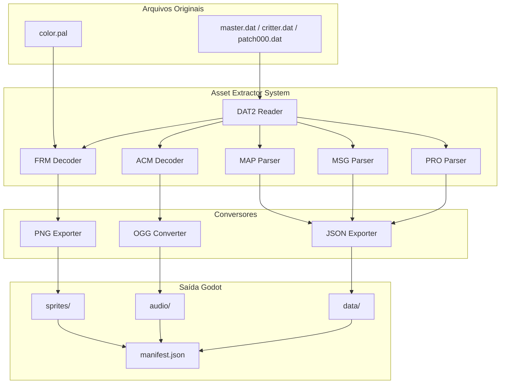

# Design Document: Fallout 2 Asset Extraction System

## Overview

Este documento descreve a arquitetura e design do sistema de extração de assets do Fallout 2 para Godot Engine. O sistema é composto por scripts Python modulares que leem os arquivos DAT2 originais, decodificam os formatos proprietários (FRM, ACM, MAP, MSG) e exportam para formatos compatíveis com Godot (PNG, OGG, JSON).

## Architecture



## Components and Interfaces

### 1. DAT2Reader (dat2_reader.py)

Responsável por ler e extrair arquivos dos containers DAT2.

```python
class DAT2Reader:
    def __init__(self, dat_path: str)
    def list_files(self) -> List[str]
    def extract_file(self, internal_path: str) -> bytes
    def extract_all(self, output_dir: str) -> Dict[str, str]
    def get_file_info(self, internal_path: str) -> FileInfo
```

**Estrutura do DAT2:**
- Header: 4 bytes (tamanho do diretório)
- Diretório: Lista de entradas (nome, offset, tamanho, comprimido)
- Dados: Arquivos raw ou comprimidos com zlib

### 2. FRMDecoder (frm_decoder.py)

Decodifica sprites FRM do Fallout 2.

```python
class FRMDecoder:
    def __init__(self, palette: List[Tuple[int, int, int]])
    def decode(self, frm_data: bytes) -> FRMImage
    def to_png(self, frm_image: FRMImage, output_path: str)
    def to_spritesheet(self, frm_image: FRMImage, output_path: str)
```

**Estrutura do FRM:**
- Header: versão, fps, num_frames, offsets por direção
- Frame data: width, height, pixels indexados (1 byte por pixel)
- Até 6 direções: NE, E, SE, SW, W, NW

### 3. PaletteLoader (palette_loader.py)

Carrega paletas de cores do Fallout 2.

```python
class PaletteLoader:
    def load(self, pal_path: str) -> List[Tuple[int, int, int]]
    def get_color(self, index: int) -> Tuple[int, int, int]
```

### 4. ACMDecoder (acm_decoder.py)

Decodifica áudio ACM para WAV/OGG.

```python
class ACMDecoder:
    def decode(self, acm_data: bytes) -> AudioData
    def to_wav(self, audio: AudioData, output_path: str)
    def to_ogg(self, audio: AudioData, output_path: str)
```

### 5. MAPParser (map_parser.py)

Parseia arquivos de mapa do Fallout 2.

```python
class MAPParser:
    def parse(self, map_data: bytes) -> MapData
    def to_json(self, map_data: MapData, output_path: str)
    def get_tiles(self, map_data: MapData) -> List[TileInfo]
    def get_objects(self, map_data: MapData) -> List[ObjectInfo]
```

### 6. MSGParser (msg_parser.py)

Parseia arquivos de mensagens/diálogos.

```python
class MSGParser:
    def parse(self, msg_data: bytes) -> Dict[int, str]
    def to_json(self, messages: Dict[int, str], output_path: str)
```

### 7. AssetOrganizer (asset_organizer.py)

Organiza assets na estrutura do projeto Godot.

```python
class AssetOrganizer:
    def __init__(self, godot_project_path: str)
    def organize_sprite(self, source: str, category: str, name: str)
    def organize_audio(self, source: str, audio_type: str, name: str)
    def organize_data(self, source: str, data_type: str, name: str)
    def generate_manifest(self) -> Dict
```

### 8. ExtractionPipeline (extraction_pipeline.py)

Orquestra todo o processo de extração.

```python
class ExtractionPipeline:
    def __init__(self, fallout2_path: str, godot_path: str)
    def extract_all(self) -> ExtractionReport
    def extract_sprites(self) -> int
    def extract_critters(self) -> int
    def extract_tiles(self) -> int
    def extract_ui(self) -> int
    def extract_audio(self) -> int
    def extract_maps(self) -> int
    def extract_texts(self) -> int
```

## Data Models

### FileInfo
```python
@dataclass
class FileInfo:
    name: str
    path: str
    size: int
    compressed_size: int
    is_compressed: bool
    offset: int
```

### FRMImage
```python
@dataclass
class FRMImage:
    version: int
    fps: int
    num_frames: int
    num_directions: int
    frames: List[List[Frame]]  # [direction][frame]
    
@dataclass
class Frame:
    width: int
    height: int
    offset_x: int
    offset_y: int
    pixels: bytes
```

### MapData
```python
@dataclass
class MapData:
    version: int
    name: str
    width: int
    height: int
    num_levels: int
    tiles: List[List[int]]  # [level][tile_index]
    objects: List[MapObject]
    scripts: List[str]

@dataclass
class MapObject:
    pid: int
    position: Tuple[int, int]
    level: int
    orientation: int
    script_id: int
```

### ExtractionReport
```python
@dataclass
class ExtractionReport:
    total_files: int
    extracted_files: int
    failed_files: int
    errors: List[ExtractionError]
    manifest_path: str
    duration_seconds: float
```


## Correctness Properties

*A property is a characteristic or behavior that should hold true across all valid executions of a system-essentially, a formal statement about what the system should do. Properties serve as the bridge between human-readable specifications and machine-verifiable correctness guarantees.*

### Property 1: DAT2 File Listing Completeness
*For any* valid DAT2 file containing N files, when the extractor lists the contents, the returned list SHALL contain exactly N entries with correct file paths.
**Validates: Requirements 1.1**

### Property 2: DAT2 Extraction Round-Trip
*For any* file content compressed with zlib and stored in a DAT2 container, extracting and decompressing SHALL produce byte-identical content to the original.
**Validates: Requirements 1.2**

### Property 3: DAT2 Priority Resolution
*For any* asset path that exists in multiple DAT2 files, the extractor SHALL return the content from the highest priority source (patch000.dat > critter.dat > master.dat).
**Validates: Requirements 1.4**

### Property 4: FRM to PNG Round-Trip
*For any* valid FRM image, converting to PNG and back to FRM SHALL preserve pixel dimensions, frame count, direction count, and pixel data (indexed colors).
**Validates: Requirements 2.1, 2.5**

### Property 5: FRM Direction Export Completeness
*For any* FRM file with N directions (1-6), the exporter SHALL produce exactly N PNG files with correct directional suffixes (_ne, _e, _se, _sw, _w, _nw).
**Validates: Requirements 2.2**

### Property 6: FRM Animation Frame Export
*For any* FRM file with N frames per direction, the exporter SHALL produce output containing all N frames (either as spritesheet or individual files).
**Validates: Requirements 2.3**

### Property 7: Transparency Preservation
*For any* FRM pixel with color index 0, the corresponding PNG pixel SHALL have alpha channel value of 0 (fully transparent).
**Validates: Requirements 2.4**

### Property 8: Critter Animation Completeness
*For any* critter type with defined animations (idle, walk, attack, death), the extractor SHALL export all animation variants with standardized naming.
**Validates: Requirements 3.2**

### Property 9: Sprite Offset Metadata Preservation
*For any* extracted sprite, the metadata JSON SHALL contain offset_x and offset_y values matching the original FRM header.
**Validates: Requirements 3.3**

### Property 10: Isometric Tile Dimensions
*For any* floor tile extracted from the game, the resulting PNG SHALL have dimensions of exactly 80x36 pixels.
**Validates: Requirements 4.3**

### Property 11: Audio Format Conversion
*For any* ACM audio file, the converter SHALL produce a valid OGG or WAV file that can be loaded by standard audio libraries.
**Validates: Requirements 6.1**

### Property 12: MAP Data Completeness
*For any* MAP file, the exported JSON SHALL contain valid tiles array, objects array, and scripts references matching the original data.
**Validates: Requirements 7.1, 7.2, 7.3**

### Property 13: MSG Parsing Round-Trip
*For any* MSG file with N message entries, parsing and re-serializing SHALL preserve all N entries with identical IDs and text content.
**Validates: Requirements 8.1, 8.2**

### Property 14: Manifest Entry Completeness
*For any* extracted asset, the manifest entry SHALL contain: original_path, output_path, asset_type, and dimensions (for images).
**Validates: Requirements 9.2**

### Property 15: Output Structure Conformance
*For any* extracted asset, the output path SHALL conform to the pattern: `godot_project/assets/{category}/{subcategory}/{filename}.{ext}` where category is sprites/audio/data.
**Validates: Requirements 10.1, 10.2, 10.3, 10.4**

## Error Handling

### DAT2 Errors
- **File Not Found**: Log error with path, skip to next DAT2 file
- **Corrupted Header**: Log error with details, mark DAT2 as unreadable
- **Decompression Failure**: Log file path and zlib error, continue with next file
- **Invalid Index**: Log warning, attempt to read remaining valid entries

### FRM Errors
- **Invalid Header**: Log error, skip file
- **Palette Mismatch**: Use default palette, log warning
- **Truncated Data**: Export partial frames, log warning with frame count

### Audio Errors
- **ACM Decode Failure**: Log error, skip file
- **Conversion Failure**: Log error with codec details, continue

### Map Errors
- **Invalid Version**: Log warning, attempt best-effort parsing
- **Missing References**: Log missing script/tile references, continue

### General Strategy
```python
class ExtractionError:
    file_path: str
    error_type: str
    message: str
    timestamp: datetime
    recoverable: bool

class ErrorLogger:
    def log_error(self, error: ExtractionError)
    def get_summary(self) -> Dict[str, int]
    def export_log(self, path: str)
```

## Testing Strategy

### Property-Based Testing Framework
O projeto utilizará **Hypothesis** (Python) para testes baseados em propriedades, configurado para executar no mínimo 100 iterações por propriedade.

### Unit Tests
Testes unitários cobrirão:
- Parsing de headers de cada formato (DAT2, FRM, ACM, MAP, MSG)
- Casos específicos de arquivos conhecidos do Fallout 2
- Tratamento de erros para arquivos inválidos/corrompidos

### Property-Based Tests
Cada propriedade de correção será implementada como um teste PBT separado:

```python
# Exemplo de estrutura de teste
# **Feature: fallout2-asset-extraction, Property 4: FRM to PNG Round-Trip**
@given(frm_data=frm_strategy())
@settings(max_examples=100)
def test_frm_png_roundtrip(frm_data):
    """FRM -> PNG -> FRM deve preservar dados"""
    png = frm_to_png(frm_data)
    reconstructed = png_to_frm(png)
    assert frm_data.dimensions == reconstructed.dimensions
    assert frm_data.pixels == reconstructed.pixels
```

### Test Data Generators
Estratégias Hypothesis para gerar dados de teste:

```python
@composite
def frm_strategy(draw):
    """Gera FRM sintético válido"""
    num_directions = draw(integers(min_value=1, max_value=6))
    num_frames = draw(integers(min_value=1, max_value=10))
    width = draw(integers(min_value=1, max_value=100))
    height = draw(integers(min_value=1, max_value=100))
    pixels = draw(binary(min_size=width*height, max_size=width*height))
    return FRMImage(...)

@composite
def dat2_strategy(draw):
    """Gera DAT2 sintético com arquivos"""
    num_files = draw(integers(min_value=1, max_value=20))
    files = [draw(file_entry_strategy()) for _ in range(num_files)]
    return create_dat2(files)
```

### Integration Tests
Testes de integração com arquivos reais do Fallout 2:
- Extração de amostra de cada tipo de asset
- Verificação de estrutura de saída
- Validação de manifesto gerado

### Test Organization
```
tools/tests/
├── test_dat2_reader.py      # Unit + PBT para DAT2
├── test_frm_decoder.py      # Unit + PBT para FRM
├── test_acm_decoder.py      # Unit + PBT para ACM
├── test_map_parser.py       # Unit + PBT para MAP
├── test_msg_parser.py       # Unit + PBT para MSG
├── test_asset_organizer.py  # Unit tests
├── test_integration.py      # Integration tests
└── conftest.py              # Fixtures e strategies
```
