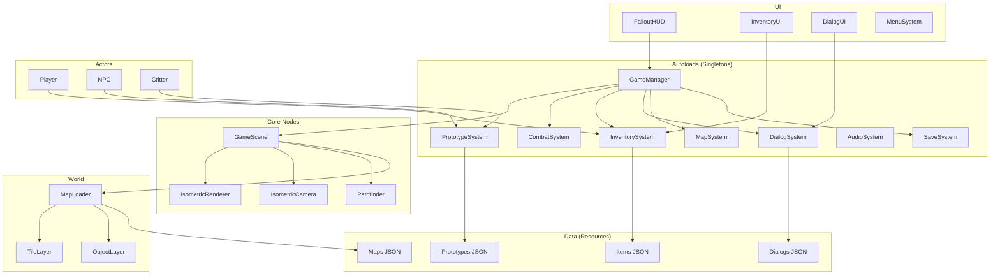

# Design Document: Migração Completa Fallout 2 para Godot

## Overview

Este documento descreve a arquitetura e design para finalizar a migração do Fallout 2 para Godot Engine 4.x. O sistema utiliza os assets já extraídos (sprites PNG, dados JSON) e expande os sistemas parcialmente implementados para criar um jogo funcional idêntico ao original.

A arquitetura segue o padrão de componentes do Godot com Autoloads para sistemas globais, Nodes para entidades do jogo, e Resources para dados.

## Architecture



## Components and Interfaces

### 1. IsometricRenderer (scripts/systems/isometric_renderer.gd)

Responsável pela conversão de coordenadas e ordenação de sprites.

```gdscript
class_name IsometricRenderer
extends Node

const TILE_WIDTH: int = 80
const TILE_HEIGHT: int = 36
const ELEVATION_OFFSET: int = 96

func tile_to_screen(tile_pos: Vector2i, elevation: int = 0) -> Vector2
func screen_to_tile(screen_pos: Vector2, elevation: int = 0) -> Vector2i
func get_sort_order(world_pos: Vector2, elevation: int = 0) -> int
func sort_sprites(sprites: Array[Node2D]) -> void
```

**Fórmulas Isométricas:**
- screen_x = (tile_x - tile_y) * (TILE_WIDTH / 2)
- screen_y = (tile_x + tile_y) * (TILE_HEIGHT / 2) - (elevation * ELEVATION_OFFSET)
- sort_order = tile_y * 1000 + tile_x + elevation * 100000

### 2. Pathfinder (scripts/systems/pathfinder.gd)

Implementa A* para navegação em grade hexagonal.

```gdscript
class_name Pathfinder
extends Node

func find_path(start: Vector2i, end: Vector2i, elevation: int = 0) -> Array[Vector2i]
func is_walkable(tile: Vector2i, elevation: int = 0) -> bool
func get_neighbors(tile: Vector2i) -> Array[Vector2i]
func get_movement_cost(from: Vector2i, to: Vector2i) -> int
func set_obstacle(tile: Vector2i, blocked: bool) -> void
```

**Algoritmo:**
- A* com heurística de distância hexagonal
- Custo base: 1 AP por tile
- Tiles bloqueados: paredes, objetos sólidos, NPCs

### 3. CombatSystem (scripts/systems/combat_system.gd) - Expandido

```gdscript
class_name CombatSystem
extends Node

signal combat_started(combatants: Array)
signal combat_ended(result: CombatResult)
signal turn_changed(combatant: Node, ap: int)
signal attack_result(attacker: Node, target: Node, result: AttackResult)

enum CombatState { INACTIVE, PLAYER_TURN, ENEMY_TURN, ANIMATING }

func start_combat(enemies: Array[Node]) -> void
func end_combat() -> void
func end_turn() -> void
func perform_attack(attacker: Node, target: Node, weapon: WeaponData) -> AttackResult
func calculate_hit_chance(attacker: Node, target: Node, weapon: WeaponData) -> int
func calculate_damage(attacker: Node, target: Node, weapon: WeaponData, hit_location: int) -> int
func get_turn_order() -> Array[Node]
```

**Fórmulas de Combate (fiéis ao original):**
- Hit Chance = Weapon_Skill - (Distance * 4) - Target_AC + Attacker_Perception * 2
- Damage = Weapon_Damage + Strength_Bonus - (Target_DR * Damage / 100)
- Critical = base_crit + (Luck * 1) + weapon_crit_bonus
- Sequence = Perception * 2

### 4. InventorySystem (scripts/systems/inventory_system.gd) - Expandido

```gdscript
class_name InventorySystem
extends Node

signal item_added(item: ItemData, slot: int)
signal item_removed(item: ItemData, slot: int)
signal item_equipped(item: ItemData, slot: EquipSlot)
signal weight_changed(current: float, max: float)

func add_item(item: ItemData, quantity: int = 1) -> bool
func remove_item(item: ItemData, quantity: int = 1) -> bool
func equip_item(item: ItemData, slot: EquipSlot) -> bool
func unequip_item(slot: EquipSlot) -> ItemData
func use_item(item: ItemData, target: Node = null) -> bool
func get_total_weight() -> float
func get_max_weight() -> float
func can_carry(weight: float) -> bool
func get_equipped_weapon() -> WeaponData
```

### 5. DialogSystem (scripts/systems/dialog_system.gd) - Expandido

```gdscript
class_name DialogSystem
extends Node

signal dialog_started(npc: Node, dialog: DialogData)
signal dialog_ended(npc: Node)
signal option_selected(option: DialogOption)
signal text_displayed(text: String)

func start_dialog(npc: Node, dialog_id: String) -> void
func end_dialog() -> void
func select_option(index: int) -> void
func check_requirement(requirement: DialogRequirement) -> bool
func execute_action(action: DialogAction) -> void
func substitute_variables(text: String) -> String
```

**Estrutura de Diálogo:**
```json
{
  "id": "dialog_001",
  "nodes": [
    {
      "id": "start",
      "text": "Olá, {player_name}. O que deseja?",
      "options": [
        {"text": "Quem é você?", "next": "who_are_you"},
        {"text": "Preciso de ajuda.", "next": "help", "requirement": {"type": "skill", "skill": "speech", "value": 50}},
        {"text": "Adeus.", "next": "end", "action": {"type": "end_dialog"}}
      ]
    }
  ]
}
```

### 6. MapLoader (scripts/systems/map_loader.gd)

```gdscript
class_name MapLoader
extends Node

signal map_loading(map_name: String)
signal map_loaded(map_data: MapData)
signal map_unloaded(map_name: String)

func load_map(map_name: String, entrance_id: int = 0) -> bool
func unload_current_map() -> void
func get_tile_at(pos: Vector2i, elevation: int) -> TileData
func get_objects_at(pos: Vector2i, elevation: int) -> Array[ObjectData]
func spawn_npcs(npc_list: Array[NPCSpawnData]) -> void
func register_exit(exit: MapExit) -> void
func check_transitions(player_pos: Vector2i) -> MapExit
```

### 7. PrototypeSystem (scripts/systems/prototype_system.gd)

```gdscript
class_name PrototypeSystem
extends Node

var item_prototypes: Dictionary = {}
var critter_prototypes: Dictionary = {}
var tile_prototypes: Dictionary = {}

func load_prototypes() -> void
func get_item_proto(pid: int) -> ItemPrototype
func get_critter_proto(pid: int) -> CritterPrototype
func get_tile_proto(pid: int) -> TilePrototype
func create_item_instance(pid: int) -> ItemData
func create_critter_instance(pid: int) -> CritterData
```

### 8. SaveSystem (scripts/systems/save_system.gd) - Expandido

```gdscript
class_name SaveSystem
extends Node

const SAVE_VERSION: int = 1
const QUICKSAVE_SLOT: int = 0

func save_game(slot: int) -> bool
func load_game(slot: int) -> bool
func quicksave() -> bool
func quickload() -> bool
func get_save_info(slot: int) -> SaveInfo
func delete_save(slot: int) -> bool
func validate_save(data: Dictionary) -> bool
func calculate_checksum(data: Dictionary) -> String
```

**Estrutura de Save:**
```json
{
  "version": 1,
  "checksum": "abc123...",
  "timestamp": "2024-12-04T10:30:00",
  "screenshot": "base64...",
  "player": { "position": [100, 200], "stats": {...}, "inventory": [...] },
  "map": { "name": "arroyo", "elevation": 0, "objects": [...] },
  "global_vars": { "quest_1_complete": true, ... },
  "visited_maps": ["arroyo", "klamath"],
  "play_time": 3600
}
```

## Data Models

### ItemData
```gdscript
class_name ItemData
extends Resource

@export var pid: int
@export var name: String
@export var description: String
@export var weight: float
@export var value: int
@export var quantity: int = 1
@export var item_type: ItemType
@export var sprite_path: String
@export var effects: Array[ItemEffect]
```

### WeaponData
```gdscript
class_name WeaponData
extends ItemData

@export var damage_min: int
@export var damage_max: int
@export var damage_type: DamageType
@export var range: int
@export var ap_cost: int
@export var skill_type: SkillType
@export var ammo_type: AmmoType
@export var ammo_capacity: int
@export var current_ammo: int
```

### CritterData
```gdscript
class_name CritterData
extends Resource

@export var pid: int
@export var name: String
@export var critter_type: CritterType  # human, animal, mutant, robot

# SPECIAL
@export var strength: int
@export var perception: int
@export var endurance: int
@export var charisma: int
@export var intelligence: int
@export var agility: int
@export var luck: int

# Derived
@export var hp: int
@export var max_hp: int
@export var ap: int
@export var max_ap: int
@export var armor_class: int
@export var sequence: int

# Behavior
@export var ai_type: AIType
@export var faction: String
@export var dialog_id: String
@export var inventory: Array[ItemData]
```

### MapData
```gdscript
class_name MapData
extends Resource

@export var name: String
@export var width: int
@export var height: int
@export var num_elevations: int
@export var tiles: Array[Array]  # [elevation][tile_index]
@export var objects: Array[MapObject]
@export var npcs: Array[NPCSpawnData]
@export var exits: Array[MapExit]
@export var scripts: Array[MapScript]
@export var ambient_sound: String
@export var music: String
```

### AttackResult
```gdscript
class_name AttackResult
extends RefCounted

var hit: bool
var critical: bool
var damage: int
var hit_location: int
var target_killed: bool
var message: String
```

## Correctness Properties

*A property is a characteristic or behavior that should hold true across all valid executions of a system-essentially, a formal statement about what the system should do. Properties serve as the bridge between human-readable specifications and machine-verifiable correctness guarantees.*

### Property 1: Isometric Coordinate Conversion Round-Trip
*For any* tile position (x, y) and elevation e, converting to screen coordinates and back to tile coordinates SHALL produce the original tile position.
**Validates: Requirements 1.1, 1.5**

### Property 2: Sprite Depth Ordering Consistency
*For any* set of sprites with different positions, the sort order SHALL be deterministic and consistent with the rule: sprites with higher y + elevation * offset appear in front.
**Validates: Requirements 1.2**

### Property 3: Elevation Layer Separation
*For any* map with N distinct elevations, the renderer SHALL create exactly N separate rendering layers.
**Validates: Requirements 1.4**

### Property 4: Camera Bounds Clamping
*For any* player position outside map bounds, the camera position SHALL be clamped to keep the viewport within valid map area.
**Validates: Requirements 2.2**

### Property 5: Pathfinding Validity
*For any* start and end positions on a map with obstacles, if a path is returned it SHALL not pass through any blocked tiles, and if no path exists the result SHALL be empty.
**Validates: Requirements 4.1, 4.2**

### Property 6: Movement AP Consumption
*For any* movement of N hexes during combat, exactly N action points SHALL be consumed from the moving entity.
**Validates: Requirements 4.3**

### Property 7: Run Speed Multiplier
*For any* base movement speed V, running speed SHALL equal V * 1.5.
**Validates: Requirements 4.4**

### Property 8: Combat Turn Order by Sequence
*For any* list of combatants with different Sequence values, the turn order SHALL be sorted in descending order by Sequence.
**Validates: Requirements 5.1**

### Property 9: Hit Chance Formula Correctness
*For any* attacker skill S, distance D, target AC, and attacker perception P, hit chance SHALL equal S - (D * 4) - AC + (P * 2), clamped between 5 and 95.
**Validates: Requirements 5.3**

### Property 10: Damage Formula Correctness
*For any* weapon damage W, strength bonus B, and target damage resistance DR, final damage SHALL equal max(1, W + B - (DR * (W + B) / 100)).
**Validates: Requirements 5.4**

### Property 11: Combat State Consistency
*For any* combat state where all enemies have HP <= 0 or have fled, combat SHALL transition to INACTIVE state.
**Validates: Requirements 5.5, 5.6**

### Property 12: Inventory Weight Calculation
*For any* inventory containing items with weights w1, w2, ..., wn, total weight SHALL equal sum of all (wi * quantity_i).
**Validates: Requirements 6.1**

### Property 13: Equipment Slot Consistency
*For any* item equipped to a slot, querying that slot SHALL return that item, and the item SHALL be marked as equipped.
**Validates: Requirements 6.2**

### Property 14: Consumable Usage Effect
*For any* consumable item with quantity Q > 0 that is used, quantity SHALL become Q - 1 and the item's effect SHALL be applied to the target.
**Validates: Requirements 6.3**

### Property 15: Encumbrance Movement Block
*For any* inventory where total weight exceeds max carry weight, the can_move property SHALL be false.
**Validates: Requirements 6.4**

### Property 16: Dialog Option Requirement Check
*For any* dialog option with a skill requirement of type T and value V, the option SHALL be enabled if and only if player's skill T >= V.
**Validates: Requirements 7.2**

### Property 17: Dialog Variable Substitution
*For any* dialog text containing variable placeholders {var_name}, the displayed text SHALL have all placeholders replaced with their corresponding values from game state.
**Validates: Requirements 7.5**

### Property 18: Map Loading Completeness
*For any* valid map JSON with T tiles, O objects, and N NPCs, loading SHALL instantiate exactly T tiles, O objects, and N NPCs.
**Validates: Requirements 8.1, 8.2, 8.5**

### Property 19: Map State Persistence
*For any* map with modified objects (moved, destroyed, state changed), unloading and reloading SHALL restore the modified state.
**Validates: Requirements 8.4**

### Property 20: Prototype Application Correctness
*For any* entity created with prototype ID P, all properties defined in prototype P SHALL be applied to the entity instance.
**Validates: Requirements 9.1, 9.2**

### Property 21: Prototype Instance Isolation
*For any* entity instance modified at runtime, the base prototype data SHALL remain unchanged.
**Validates: Requirements 9.4**

### Property 22: Script Global Variable Round-Trip
*For any* global variable written with value V, subsequent reads SHALL return V until overwritten.
**Validates: Requirements 10.3**

### Property 23: NPC Death Inventory Access
*For any* NPC that dies, the corpse SHALL contain all items that were in the NPC's inventory at time of death.
**Validates: Requirements 11.5**

### Property 24: Menu Pause State
*For any* menu opened during gameplay (except combat), the game time SHALL be paused.
**Validates: Requirements 14.5**

### Property 25: Save/Load Round-Trip
*For any* game state S, saving and then loading SHALL produce a state S' that is functionally identical to S.
**Validates: Requirements 15.1, 15.2**

### Property 26: Save Metadata Completeness
*For any* save file created, it SHALL contain: version number, checksum, timestamp, and current map location.
**Validates: Requirements 15.3**

### Property 27: Save Corruption Detection
*For any* save file with modified data, the checksum validation SHALL fail and the load SHALL be rejected.
**Validates: Requirements 15.4**

### Property 28: Audio Volume Application
*For any* volume setting V between 0 and 1, all audio of that category SHALL play at volume V.
**Validates: Requirements 16.4**

## Error Handling

### Map Loading Errors
- **File Not Found**: Log error, show message to player, return to menu
- **Invalid JSON**: Log parse error with line number, use fallback empty map
- **Missing Assets**: Log warning, use placeholder sprites, continue loading

### Combat Errors
- **Invalid Target**: Log warning, cancel attack, refund AP
- **Out of Range**: Show message to player, cancel attack
- **No Ammo**: Show message, prevent attack

### Save/Load Errors
- **Disk Full**: Show error message, suggest deleting old saves
- **Corrupted Save**: Show warning, offer to delete or attempt recovery
- **Version Mismatch**: Attempt migration, warn if data loss possible

### Script Errors
- **Syntax Error**: Log error with script name and line, skip script
- **Runtime Error**: Log error, continue game execution
- **Missing Function**: Log warning, return default value

## Testing Strategy

### Property-Based Testing Framework
O projeto utilizará **GUT (Godot Unit Test)** para testes unitários e **GdUnit4** para testes baseados em propriedades, configurado para executar no mínimo 100 iterações por propriedade.

### Unit Tests
Testes unitários cobrirão:
- Conversões de coordenadas isométricas
- Cálculos de combate (hit chance, damage)
- Operações de inventário
- Parsing de dados JSON
- Serialização de saves

### Property-Based Tests
Cada propriedade de correção será implementada como um teste PBT separado:

```gdscript
# Exemplo de estrutura de teste
# **Feature: godot-game-migration, Property 1: Isometric Coordinate Conversion Round-Trip**
func test_isometric_roundtrip():
    for i in range(100):
        var tile_x = randi_range(-100, 100)
        var tile_y = randi_range(-100, 100)
        var elevation = randi_range(0, 2)
        
        var screen = IsometricRenderer.tile_to_screen(Vector2i(tile_x, tile_y), elevation)
        var result = IsometricRenderer.screen_to_tile(screen, elevation)
        
        assert_eq(result, Vector2i(tile_x, tile_y))
```

### Test Data Generators
Estratégias para gerar dados de teste:

```gdscript
func generate_random_combatant() -> Dictionary:
    return {
        "strength": randi_range(1, 10),
        "perception": randi_range(1, 10),
        "agility": randi_range(1, 10),
        "luck": randi_range(1, 10),
        "hp": randi_range(10, 100),
        "ap": randi_range(5, 15)
    }

func generate_random_inventory() -> Array:
    var items = []
    for i in range(randi_range(0, 20)):
        items.append({
            "pid": randi_range(1, 1000),
            "quantity": randi_range(1, 10),
            "weight": randf_range(0.1, 10.0)
        })
    return items
```

### Integration Tests
Testes de integração com cenários reais:
- Carregar mapa de Arroyo e verificar tiles/NPCs
- Iniciar combate e executar sequência de turnos
- Salvar jogo, modificar estado, carregar e verificar restauração
- Executar diálogo completo com todas as branches

### Test Organization
```
godot_project/tests/
├── unit/
│   ├── test_isometric_renderer.gd
│   ├── test_combat_calculations.gd
│   ├── test_inventory_operations.gd
│   ├── test_pathfinder.gd
│   └── test_save_system.gd
├── property/
│   ├── test_coordinate_roundtrip.gd
│   ├── test_combat_formulas.gd
│   ├── test_inventory_weight.gd
│   └── test_save_load_roundtrip.gd
├── integration/
│   ├── test_map_loading.gd
│   ├── test_combat_flow.gd
│   └── test_dialog_flow.gd
└── conftest.gd
```
